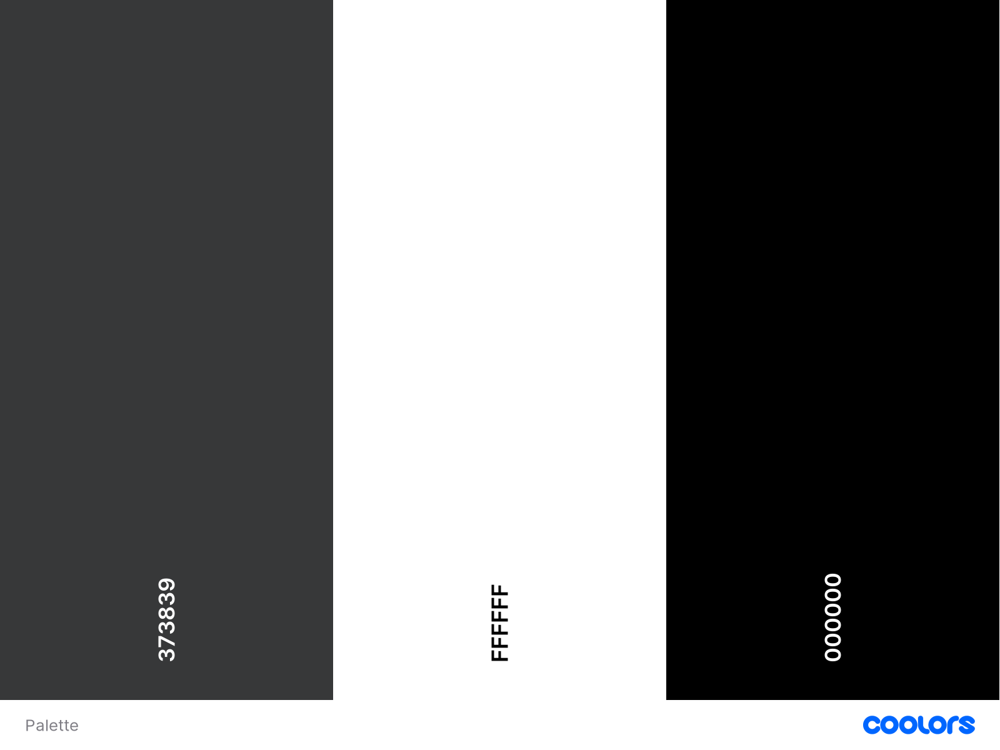

# Portfolio
---------------
### Bonjour, je m'appelle Andy LOUIS et j'ai 23 ans. J'occupe aujourd'hui un poste de Technicien Digitale Workplace en tant qu'alternant en BTS SIO (2ème année) à l'école ITIC Paris. Ceci est mon portfolio dans lequel je vais régulièrement ajouter du contenu tel que les projets que j'aurais fait à l'avenir. 
---------------
#### [Afficher le site](https://andyl94.github.io/PortfolioV2/)
---------------
## Charte Graphique

---------------
## Charte Typographique
### Fonts :
- Montserrat
- Poppins
---------------
## Extras
### Icons : Font Awesome (https://fontawesome.com/)
---------------
## Composition du répertoire
* index.html
* css/main.css
* asset/
* favicon/
* js/